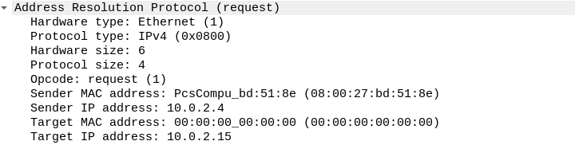

# Ataques en la red interna 

Una vez que estamos dentro de la red wifi, nos encontramos ante un escenario totalmente diferente al anterior. Tenemos que realizar descubrimiento de equipos, comprobar configuraciones por defecto, explorar vulnerabilidades del hardware de red, entre una larga lista de tareas. Dicho esto comencemos por el primer paso: _descubrimiento de objetivos_

!!!warning
    Podemos conectarnos a la red que hemos conseguido crackear sin ningún problema puesto que no existe ninguna restricción. Para evitar estas dispositivos no autorizados en nuestra red es recomendable implementar un filtrado con MAC, de forma que solo se permita la conexión a una determiada lista de dispositivos.
## Descubrimiento de dispositivos

Teniendo en cuenta las características estándar de una red cuyo hardware de red está suministado por el ISP (Internet Service Provider) y asumiendo configuraciones por defecto existirá un servidor DHCP (Dynamic Host Configuration Protocol) el cual automáticamente nos asignirá los datos necesarios para tener acceso a internet.

Al obtener una dirección ip automáticamente (como consecuencia del servidor DHCP), podremos tener cierta idea del tipo de red en el que estamos trabajando y en consecuncia realizar un escaneo de los dispositivos existentes.

El primer paso sería obtener determinada información de la red, para ello podemos utilizar las herramientas que nos proporiciona nuestro sistema GNU/Linux, concretamente  _route_

    $ route 

    Kernel IP routing table
    Destination     Gateway         Genmask         Flags Metric Ref    Use Iface
    default         10.0.2.1        0.0.0.0         UG    100    0        0 wlan0
    10.0.2.0        0.0.0.0         255.255.255.0   U     100    0        0 wlan0


Generalmente el comando _route_ nos mostrará algo similar a lo anterior. Dentro de esta salida nos permite obtener cierta información:

* Puerta de enlace (Gateway): Esta dirección nos permitirá saber mediante que dispositivo estamos saliendo a Internet
* Máscara de red: Nos permitirá determinar en que tipo de red estamos trabajando (Tipo A,B,C)
 
Esta información nos permitirá posteriormente realizar un escaneo de la red en busca de dispositivos.

!!! warning
    Tenemos dirección ip de forma automática puesto que existe un servidor DHCP habilitado en la red. Para mayor seguridad podemos deshabilitar dicho servicio y asignar las direcciones ip de forma autmática a los diferentes dispositivos.

    También podemos implementar un filtrado por dirección ip, creando una lista blanca o negra.

### Protocolo ARP

Para realizar el descubrimiento de los equipos disponibles en la red usaremos la herramienta _nmap_ puesto que nos permite obtener gran cantidad de información dentro de una red. En primer lugar, realizaremos un escaneo ARP (debido a su velocidad) para enumerar los dispositivos existentes:

    $ nmap -sn 10.0.2.0/24
    Starting Nmap 7.70 ( https://nmap.org ) at 2019-01-09 18:55 CET
    Nmap scan report for 10.0.2.1
    Host is up (0.00032s latency).
    MAC Address: 52:54:00:12:35:00 (QEMU virtual NIC)
    Nmap scan report for 10.0.2.2
    Host is up (0.00019s latency).
    MAC Address: 52:54:00:12:35:00 (QEMU virtual NIC)
    Nmap scan report for 10.0.2.3
    Host is up (0.00020s latency).
    MAC Address: 08:00:27:8B:3F:6E (Oracle VirtualBox virtual NIC)
    Nmap scan report for 10.0.2.15
    Host is up (0.00039s latency).
    MAC Address: 08:00:27:7E:F5:47 (Oracle VirtualBox virtual NIC)
    Nmap scan report for 10.0.2.4
    Host is up.
    Nmap done: 256 IP addresses (5 hosts up) scanned in 7.61 seconds

El protocolo ARP (Address Resolution Protocol) es un protoclo que trabaja en la capa 2 de la [pila TCP/IP](https://simple.wikipedia.org/wiki/TCP/IP_model), este protocolo permite traducir las direcciones físicas (MAC) en direcciones lógicas (IP) que identifiquen nuestros dispositivos. Este traducción de direcciones es necesaria para operar posteriormente.

Esta información queda almacenada en nuestro sistema, de forma que podemos consultarla en cualquier momento haciendo uso de la herramienta _arp_

    $ arp -e 
    Address                  HWtype  HWaddress           Flags Mask            Iface
    10.0.2.1                 ether   52:54:00:12:35:00   C                     wlan0
    10.0.2.15                ether   08:00:27:7e:f5:47   C                     wlan0

Podemos consultar las direcciones físicas (HWaddress), relacionadas con cada dirección IP (Address). La información almacenada en esta tabla es esencial, puesto que cuando queremos enviar datos (paquetes) entre diferentes máquinas (nustra máquina local y un servidor web), se realizará mediante la dirección física, por lo que el sistema operativo consultará los datos almacenados en esta tabla.

#### ¿Qué sucede si no esta la dirección en la tabla ARP?

Cuando no encontramos una dirección en la tabla ARP, el sistema operativo envia un paquete ARP _request_ preguntando _Who has 10.0.2.15?_ hacia una dirección en concreto (dirección de broadcast), esto puede observarse examinando un paquete tipo request con Wirehark:


Como podemos ver la dirección de destino del paquete es la dirección de broadcast (ff:ff:ff:ff:ff:ff). Por parte del protocolo ARP, se envía la siguiente información.



Como se puede observar se indica la dirección ip destino, la dirección que queremos descubrir en la red.

En caso de que dicha dirección exista, tendrá una dirección MAC asociada, por lo cual el protolo ARP recibirá respuesta con un paquete ARP tipo _reply_ donde se encuentra la dirección física del dispositivo.


Si la dirección ip a la cual estamos enviando el paquete _request_ no se encuentra en la red, no obtenedremos respuesta por parte del protocolo ARP. 

Ententiendo como funciona el protocolo ARP, sería muy fácil llegar a la conclusión de que si enviamos paquetes a todas las direcciones posibles dentro de nuestra máscara de red, solo aquellas peticiones que tengan respuesta harán referencia a los dispositivos existentes en la red.

#### Problemas del escaneo ARP
El principal problema que plantea un escaneo de tipo ARP es que genera mucho ruido en la red, de forma que puede ser detectado facilmente por cualquier detector de intrusos. Sin embargo, en el escenario en el que estamos se supone que no existen dichos mecanismos.

__Como ejemplo del ruido generado en la red se deja a continuación un paquete .pcapg__ 

## Capturando  tráfico de red

El siguiente paso a seguir cuando tenemos los objetivos descubiertos sería identificar cual es el dispositivo que nos interesa y comenzar a capturar tráfico del mismo. La finalidad de esta obtención de tráfico es conseguir información del objetivo, para posteriormente realizar ataques dirigidos.

### Capturando tráfico de un dispositivo: ARP Spoofing

Con los conocimientos explicados anteiormente sobre ARP, podemos entender perfectamente como funciona el ataque _arp spoofing_. Este ataque consiste en alterar la información almacenada en las tablas ARP del sistema, de forma que alteremos la dirección MAC del router para que apunte a nuestro equipo.

Con esta modificación pretendemos hacer que cualquier paquete que envíe la víctima a internet, circule por nuestro equipo ( ya que nos encontramos entre su conexión y la del router), como consecuencia de dicha redirección de paquetes podemos realizar cualquier análisis o modificación de dicho paquete.


Como podemos ver en el esquema, la víctima se pensará que la dirección física del router es la nuestra (por lo tanto los paquetes serán enviados a nuestro equipo), posteriormente nosotros redireccionaremos dichos paquetes al router (o switch) pertinente. El retraso de los paquetes causado por dicha redirección es completamente irrelevante.

### Arp Spoofing en Linux

Dentro de las diferentes distribuciones GNU/Linux tenemos diferentes herramientas para realizar ARP Spoofing, la más común es arpspoof, sin embargo, existen aplicaciones más completas como _ettercap_ o _bettercap_ que nos permiten realizar tareas más complejas de forma sencilla, como veremos posteriormente.

Para realizar un ataque arp spoofing, el primer paso es activar la redirección de paquetes en nuestro equipo (para evitar así que la víctima pierda conectividad de red), para ello simplemente modificamos el archivo _/proc/sys/net/ipv4/ip_forward_

    $ echo 1 > /proc/sys/net/ipv4/ip_forward

Con esto tendremos activada la redirección de paquetes de forma temporal, una vez realizado este paso simplemente tenemos que ejecutar el comando arpspoof con las direcciones de la víctima y el router.

    $ arpspoof -t 10.0.2.15 10.0.2.1

De esta forma estamos enviando de forma constante paquetes __arp reply__ informando de que la dirección MAC correspondiente a 10.0.2.1 (el router), corresponde con la de nuestro dispositivo (10.0.2.15). Cuando la víctima pregunte cual es la dirección física de (10.0.2.1) se encontrará con los paquetes que estamos enviando y automáticamente guardará la nuestra.

Llegados a este punto abriendo un sniffer podemos observar el tráfico saliente de este dispositivo. Posteriormente podemos usar alguna herramienta como _Wireshark_ para analizar el tráfico.

__Ejemplo de captura de tráfico hacia páginas con cifrado SSL [SSL Capture.pcapng]()__


!!! info

    Para prevenir este ARP spoofing es posible introducir las entradas dentro de la tabla ARP de forma manual.

## Modificando paquetes de red

Capturar tráfico saliente puede ser de gran ayuda para entender los protocolos que usa nuestro objetivo y en el caso de que se use un protocolo no seguro poder obtener credenciales que pueden ser reutilizadas, sin embargo, la mayoria de los protocolos que se utilizan suelen estar cifrados, es en este punto donde entra la modificación de paquetes.

### Bettercap: The Swiss Army knife for 802.11

Bettercap es una herramienta que nació como evolución de _ettercap_, de forma que nos permite implementar mayor número de ataques facilitando mucho determindas labores (como la creación de un proxy http manual). Podemos realizar múltiples acciones mediantes los denomidamos _caplets_.

Los _caplets_ son fichers .cap que contienen instrucciones de bettercap, de forma que podemos realizar diferentes acciones almacenandolas todas ellas en un simple fichero (para su posterior reutilización)

#### DNS Spoofing

Uno de los ataques que podemos realizar dentro de una red local consiste en la modificación de las peticiones DNS para que apunten a diferentes sitios web. Este ataque nos permite realizar ataques de phishing y obtener credenciales o redirigir a la víctima hacia un sitio con malware.

Para realizar un ataque de DNS spoofing con Bettercap, en primer lugar necesitamos crear un fichero con el formato _hosts_ para indicar las páginas que queremos redireccionar.

```hostsSpoofing
 
	10.0.2.15 google.com	 
	10.0.2.15 facebook.com
	10.0.2.15  uco.es
```
[hostsSpoofing]()

De esta forma cualquier petición hacia estas direcciones será automaticamente redirigida a nuestro servidor. Posteriormente tendremos que realizar el caplet para ejecutar con Bettercap.

```dnsSpooging.cap

	set dns.spoof.hotst ./hostsDns
	dns.spoof on
```
[dnsSpoofing.cap]()

Por último ejecutamos bettercap:
	
	$ bettecap -caplet dns_spoofing.cap

Previamente a relaizar este ataque tendremos que haber realizado un arp spoofing (para poder modificar los paquetes). Podemos incluir dicho ataque dentro del fichero dnsSpoofing.cap con las siguientes modificaciones

```dnsSpooging.cap
	arp.spoof.targets 10.0.2.15
	arp.spoof on
	set dns.spoof.hotst ./hostsSpoofing
	dns.spoof on

```
En el caso de que queramos realizar el ataque en todo el segmento en el que nos encotramos, podemos obviar el parámetro _arp.spoof.targets_


